# Istio LLM Filter 架构设计文档

## 1. 背景与目标

### 1.1 背景

大语言模型（LLM）推理服务具有以下特点：

1. **计算密集**：单次推理需要大量 GPU 计算资源，一个请求可能占用数秒到数分钟的 GPU 时间
2. **请求异构**：不同请求的 Prompt 长度差异巨大（几十到几万 Token），处理时间差异可达 100 倍以上
3. **KV-Cache 重用**：相同前缀的 Prompt 可以复用 KV-Cache，显著提升推理效率，最高可节省 80% 以上的计算量
4. **排队延迟敏感**：Prefill 阶段（处理输入 Prompt）的排队会直接影响首 Token 延迟（TTFT），用户体验对此非常敏感

传统的负载均衡算法（Round Robin、Random、Least Connections）无法感知这些特性，导致以下问题：

| 问题 | 原因 | 影响 |
|------|------|------|
| **负载不均衡** | 长 Prompt 请求被随机分发 | 某些节点严重过载，其他节点空闲 |
| **Cache 未命中** | 相似请求被分发到不同节点 | 无法复用 KV-Cache，重复计算 |
| **延迟波动大** | 热点节点排队时间过长 | TTFT 从毫秒级恶化到秒级 |
| **资源浪费** | GPU 显存中的 KV-Cache 无法复用 | 显存占用高，吞吐量下降 |

### 1.2 目标

本项目旨在为 Istio 提供 LLM 推理场景的智能负载均衡能力：

| 目标 | 说明 | 实现方式 |
|------|------|----------|
| **负载感知** | 基于实时队列深度和 Prefill 负载进行调度 | 通过 Metadata-Center 收集各节点统计数据 |
| **缓存感知** | 将相似 Prompt 路由到缓存命中率高的节点 | 基于 Prompt Hash 前缀匹配查询缓存位置 |
| **协议兼容** | 支持 OpenAI 协议，兼容主流推理框架 | 实现 Transcoder 抽象层，支持协议转换 |
| **无侵入** | 作为 Envoy Filter 部署，不修改推理服务 | 使用 Golang Filter 在数据平面实现 |
| **可观测** | 提供请求级别的 TTFT、延迟等指标 | 在 Filter 中记录关键时间点和统计数据 |

### 1.3 与 aigw 的关系

本项目从 [aigw](../aigw/) 项目迁移而来，核心算法保持一致。迁移的主要目的是让 LLM 负载均衡能力能够融入 Istio 生态，复用 Istio 的服务发现、流量管理、可观测性等基础设施。

| 对比项 | aigw | istio-llm-filter |
|--------|------|------------------|
| 部署形态 | 独立网关，需要单独运维 | Istio Sidecar，与应用一起管理 |
| 配置管理 | 自定义 CRD | 标准 EnvoyFilter |
| 服务发现 | 自建服务发现机制 | 复用 Istio 的 xDS 协议 |
| 证书管理 | 需要单独配置 | 复用 Istio 的 mTLS |
| 可观测性 | 自建指标收集 | 集成 Istio 的 Prometheus/Jaeger |

---

## 2. 整体架构

### 2.1 系统架构图

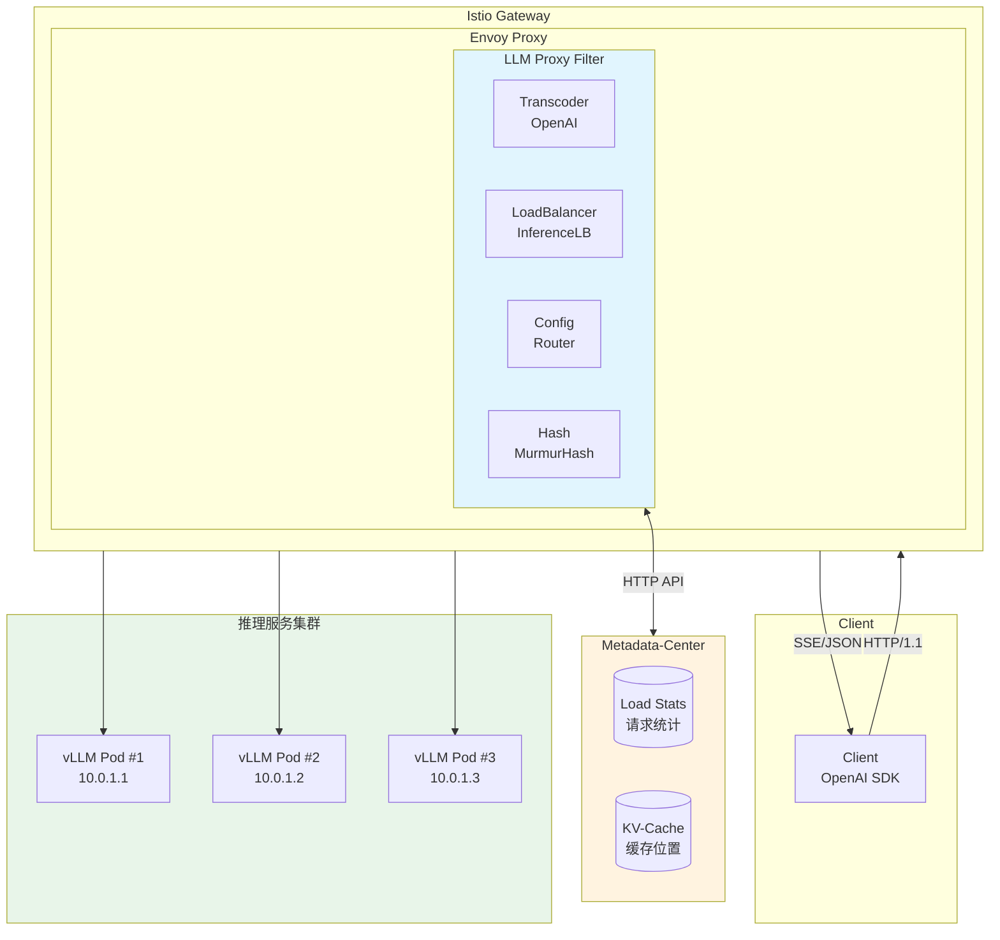

上图展示了系统的整体架构，包含以下核心组件：

**客户端层**：使用标准 OpenAI SDK 发起请求，支持流式（SSE）和非流式（JSON）两种响应模式。客户端无需感知后端的负载均衡逻辑。

**网关层**：Istio Ingress Gateway 作为流量入口，内部运行 Envoy Proxy。我们开发的 LLM Proxy Filter 作为 Golang Filter 嵌入 Envoy 的 HTTP 处理链中，在请求/响应路径上执行智能路由逻辑。

**元数据服务**：Metadata-Center 是一个轻量级的 HTTP 服务，负责存储两类数据：
- **Load Stats**：各推理节点的实时负载统计（排队请求数、排队 Prompt 总长度）
- **KV-Cache**：Prompt Hash 到节点 IP 的映射关系，用于缓存亲和性路由

**推理服务层**：后端是多个运行 LLM 推理框架（vLLM、SGLang、TensorRT-LLM）的 Pod。每个 Pod 独立维护自己的 KV-Cache，Filter 的目标是将请求路由到最合适的 Pod。

### 2.2 组件职责

| 组件 | 职责 | 技术选型 | 说明 |
|------|------|----------|------|
| **LLM Proxy Filter** | 请求解析、路由、转码、负载均衡 | Envoy Golang Filter + HTNN 框架 | 核心组件，实现所有智能路由逻辑 |
| **Metadata-Center** | 统计负载数据、存储 KV-Cache 位置 | HTTP Server + 内存存储 | 可选组件，不启用时退化为随机路由 |
| **Istio Gateway** | 流量入口、TLS 终止、路由分发 | Envoy + Istio 配置 | 复用 Istio 基础设施 |
| **推理服务** | 执行 LLM 推理、管理 KV-Cache | vLLM / SGLang / TensorRT-LLM | 不需要修改，保持原生 OpenAI 兼容 API |

### 2.3 请求流转路径

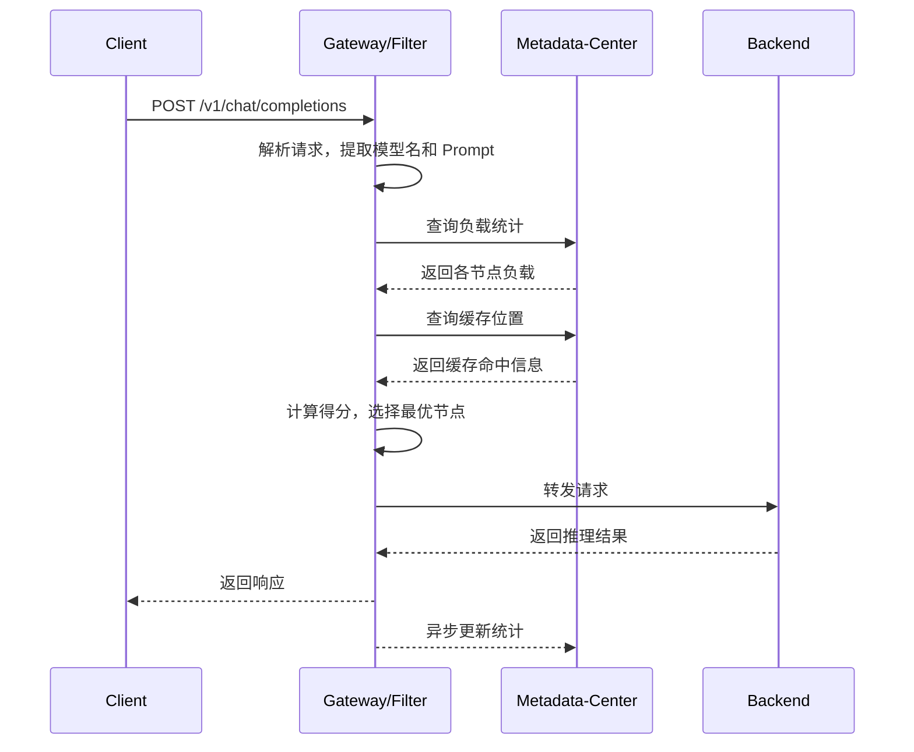

一个典型请求的处理流程如下：

1. **请求到达**：客户端发送 POST `/v1/chat/completions` 请求到 Gateway，请求体包含模型名称和对话消息
2. **请求解析**：Filter 解析 JSON 请求体，提取模型名（如 `qwen-2.5-72b`）和 Prompt 内容
3. **负载查询**：Filter 向 Metadata-Center 发起同步请求，获取目标集群中各节点的实时负载数据
4. **缓存查询**：Filter 计算 Prompt 的分块哈希，向 Metadata-Center 查询哪些节点缓存了相似前缀
5. **路由决策**：LoadBalancer 根据负载统计和缓存命中率计算各节点得分，选择得分最高的节点
6. **请求转发**：通过 Envoy 的 `SetUpstreamOverrideHost` API 将请求定向转发到选中的节点
7. **响应处理**：推理服务返回结果（流式 SSE 或完整 JSON），Filter 进行必要的转码后返回客户端
8. **统计更新**：Filter 异步更新 Metadata-Center 中的统计数据和缓存位置信息

---

## 3. 核心概念

### 3.1 KV-Cache 感知

#### 什么是 KV-Cache？

在 Transformer 架构中，Self-Attention 机制需要计算每个 Token 与所有历史 Token 之间的注意力权重。这个过程需要用到历史 Token 的 Key 和 Value 向量。

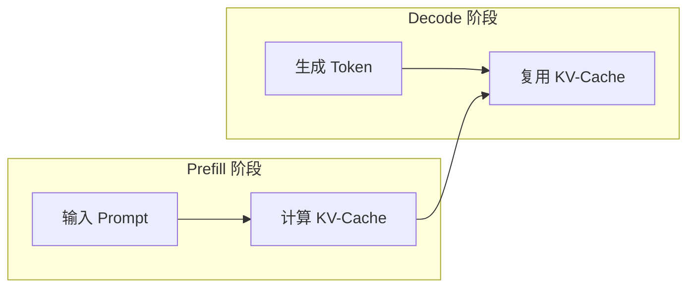

LLM 推理分为两个阶段：

**Prefill 阶段**：处理输入 Prompt，为每个 Token 计算 Key/Value 向量并存入 KV-Cache。这个阶段是计算密集型的，时间与 Prompt 长度成正比。

**Decode 阶段**：逐个生成输出 Token。每生成一个新 Token，只需计算该 Token 的 KV，然后复用 Cache 中历史 Token 的 KV。这个阶段相对较快，但受限于 GPU 显存带宽。

KV-Cache 的价值在于：如果两个请求有相同的前缀（比如相同的系统提示词），后一个请求可以直接复用前一个请求计算好的 KV-Cache，跳过 Prefill 阶段的大部分计算。

#### 为什么需要 Cache 感知路由？

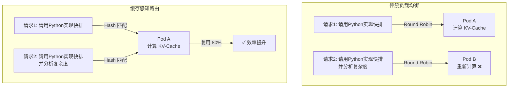

上图对比了传统负载均衡和缓存感知路由的差异：

**传统方式**：Round Robin 将请求2分发到 Pod B，即使请求2的 Prompt 与请求1有 80% 的重叠，Pod B 仍需要从头计算整个 Prompt 的 KV-Cache。

**缓存感知**：通过 Prompt Hash 匹配，系统发现请求2的前缀与请求1相同，于是将请求2也路由到 Pod A。Pod A 的 KV-Cache 中已经有前 80% 的内容，只需计算剩余 20%，显著提升效率。

#### Prompt Hash 计算

为了实现前缀匹配，我们采用分块累积哈希策略：

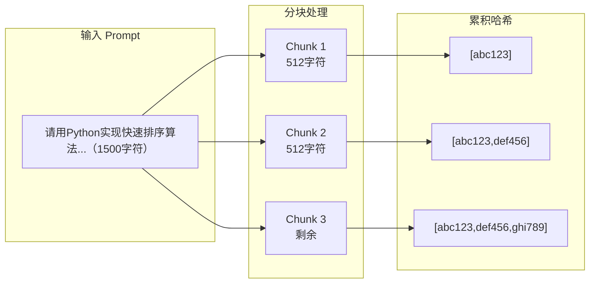

**分块策略**：将 Prompt 按固定长度（默认 512 字符）分块，每块独立计算 MurmurHash3 哈希值。

**累积格式**：哈希数组采用累积格式存储，例如 `["abc123", "abc123,def456", "abc123,def456,ghi789"]`。这种格式支持高效的前缀匹配——只需找到最长的公共前缀，即可确定缓存命中的比例。

**匹配示例**：
- 请求 A 的哈希：`["abc123", "abc123,def456", "abc123,def456,ghi789"]`
- 请求 B 的哈希：`["abc123", "abc123,def456", "abc123,xyz999"]`
- 匹配结果：前 2 块相同，第 3 块不同，缓存命中率 = 2/3 = 66.7%

### 3.2 负载感知

#### 传统负载均衡的问题

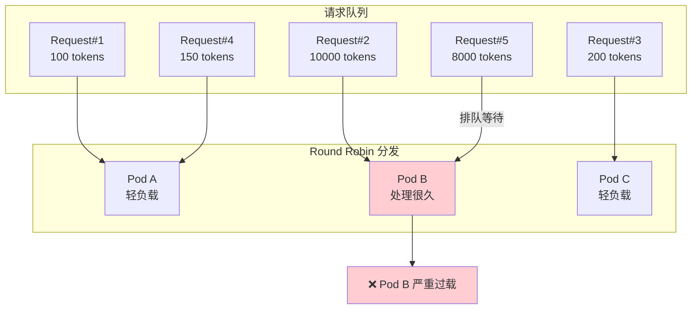

传统负载均衡算法基于请求数量或连接数进行决策，无法感知 LLM 请求的异构性：

- **Request#2**（10000 tokens）和 **Request#5**（8000 tokens）被 Round Robin 分配到 Pod B
- 这两个长请求的 Prefill 时间可能长达数秒甚至数十秒
- Pod A 和 Pod C 收到的都是短请求，很快处理完后就空闲了
- 结果：Pod B 严重过载，新请求需要排队等待，而其他节点却处于空闲状态

#### 负载感知调度

我们通过 Metadata-Center 实时收集各 Pod 的负载指标：

| 指标 | 含义 | 用途 |
|------|------|------|
| `queuedReqs` | 当前排队的请求数 | 反映整体负载水平 |
| `promptLength` | 排队请求的 Prompt 总长度 | 反映 Prefill 阶段的工作量 |

这些指标通过 Filter 在请求生命周期的不同阶段异步更新：
- 请求开始时：`AddRequest`，增加 `queuedReqs` 和 `promptLength`
- 首 Token 到达时：`DeletePromptLength`，减少 `promptLength`（Prefill 完成）
- 请求结束时：`DeleteRequest`，减少 `queuedReqs`

### 3.3 多维度评分算法

#### 评分公式

我们设计了一个综合考虑缓存命中率和负载情况的评分公式：

```
Score = W1 × CacheRatio - W2 × NormalizedReqLoad - W3 × NormalizedPrefillLoad
```

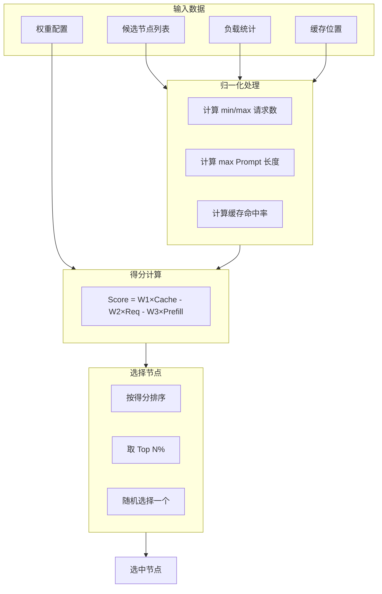

#### 变量说明

| 变量 | 范围 | 计算方式 | 说明 |
|------|------|----------|------|
| `CacheRatio` | [0, 1] | 最长前缀匹配块数 / 总块数 | 值越大，说明该节点缓存了更多相关数据 |
| `NormalizedReqLoad` | [0, 1] | (当前排队数 - 最小值) / delta | 归一化的请求队列深度 |
| `NormalizedPrefillLoad` | [0, 1] | 当前 PromptLength / 最大 PromptLength | 归一化的 Prefill 工作量 |

其中 `delta = max(2, maxReqs - minReqs)`，最小值为 2 避免除零错误。

#### 权重配置

| 权重 | 默认值 | 说明 |
|------|--------|------|
| W1 (CacheRatioWeight) | 2 | Cache 命中的收益权重，值越大越倾向于选择缓存命中的节点 |
| W2 (RequestLoadWeight) | 1 | 请求队列深度的惩罚权重，**支持动态调整** |
| W3 (PrefillLoadWeight) | 3 | Prefill 队列深度的惩罚权重，通常设置较高因为 Prefill 是性能瓶颈 |

**动态权重调整**：当各节点负载差异较大时（delta > 5），系统会自动增加 W2 的有效值，以更积极地避开高负载节点：
```
if delta > 5:
    effectiveW2 = W2 × (delta / 5)
```

#### 评分示例

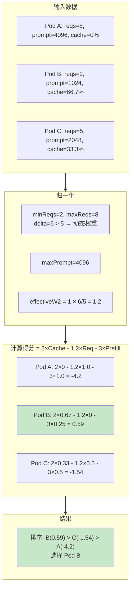

**计算过程详解**：

1. **输入数据**：三个候选 Pod 的当前状态
   - Pod A：排队 8 个请求，Prompt 总长 4096，无缓存命中
   - Pod B：排队 2 个请求，Prompt 总长 1024，缓存命中 66.7%
   - Pod C：排队 5 个请求，Prompt 总长 2048，缓存命中 33.3%

2. **归一化参数计算**：
   - `delta = max(2, 8-2) = 6`，因为 delta > 5，启用动态权重
   - `maxPrompt = 4096`
   - `effectiveW2 = 1 × (6/5) = 1.2`

3. **各节点归一化值**：
   - Pod A: `NormReq = (8-2)/6 = 1.0`, `NormPrefill = 4096/4096 = 1.0`
   - Pod B: `NormReq = (2-2)/6 = 0.0`, `NormPrefill = 1024/4096 = 0.25`
   - Pod C: `NormReq = (5-2)/6 = 0.5`, `NormPrefill = 2048/4096 = 0.5`

4. **得分计算** (W1=2, W2=1.2, W3=3)：
   - Pod A: `2×0 - 1.2×1.0 - 3×1.0 = -4.2`（无缓存 + 高负载 = 最差）
   - Pod B: `2×0.67 - 1.2×0 - 3×0.25 = 0.59`（高缓存 + 低负载 = 最优）
   - Pod C: `2×0.33 - 1.2×0.5 - 3×0.5 = -1.54`（中等）

5. **最终选择**：Pod B 得分最高，被选中处理请求

---

## 4. 模块设计

### 4.1 Filter 模块 (pkg/filter/)

#### 职责

Filter 模块是整个插件的核心，负责处理请求/响应的完整生命周期。它实现了 HTNN 框架的 `PassThroughFilter` 接口，在 Envoy 的 HTTP 处理链中执行智能路由逻辑。

#### 类图

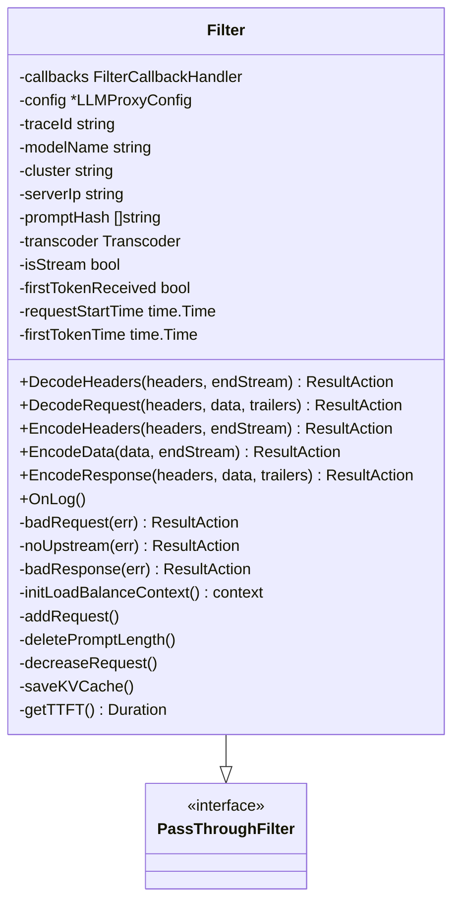

#### 关键字段说明

| 字段 | 类型 | 说明 |
|------|------|------|
| `callbacks` | FilterCallbackHandler | Envoy 回调接口，用于修改请求/响应、设置上游地址等 |
| `config` | *LLMProxyConfig | 插件配置，包含路由规则和 LB 参数 |
| `traceId` | string | 请求追踪 ID，用于日志关联和调试 |
| `modelName` | string | 从请求中解析出的模型名称 |
| `cluster` | string | 根据路由规则确定的目标集群名 |
| `serverIp` | string | 负载均衡选中的后端 IP:Port |
| `promptHash` | []string | Prompt 的分块累积哈希数组 |
| `transcoder` | Transcoder | 协议转码器实例 |
| `isStream` | bool | 是否为流式响应 |
| `firstTokenReceived` | bool | 是否已收到首个 Token（用于计算 TTFT） |
| `requestStartTime` | time.Time | 请求开始处理的时间戳 |
| `firstTokenTime` | time.Time | 首个 Token 到达的时间戳 |

#### 生命周期方法

| 方法 | 调用时机 | 返回值 | 处理逻辑 |
|------|----------|--------|----------|
| `DecodeHeaders` | 收到请求头 | `WaitAllData` | 返回等待完整请求体的信号 |
| `DecodeRequest` | 收到完整请求 | `Continue` / `LocalResponse` | 核心处理：解析、路由、转码、选后端 |
| `EncodeHeaders` | 收到响应头 | `Continue` / `WaitAllData` | 保存 Cache 位置，判断流式/非流式 |
| `EncodeData` | 收到流式数据块 | `Continue` | 转码响应块，检测首 Token |
| `EncodeResponse` | 收到完整响应 | `Continue` | 转码完整响应体 |
| `OnLog` | 请求结束 | - | 清理统计数据，记录访问日志 |

#### DecodeRequest 处理流程

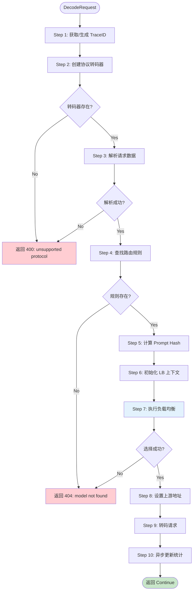

**各步骤详细说明**：

**Step 1 - 获取 TraceID**：优先从请求头获取已有的追踪 ID（支持 `x-request-id`、`x-trace-id`、`x-amzn-trace-id`），如果不存在则生成新的 UUID。TraceID 会贯穿整个请求生命周期，用于日志关联。

**Step 2 - 创建转码器**：根据配置的 `protocol` 字段（如 `openai`）获取对应的 Transcoder 实例。如果协议不支持，返回 400 错误。

**Step 3 - 解析请求**：调用 Transcoder 的 `GetRequestData` 方法，从 JSON 请求体中提取：
- 模型名称（`model` 字段）
- Prompt 内容（所有消息的文本拼接）
- 请求选项（是否流式、LoRA 适配器等）

**Step 4 - 查找路由规则**：根据模型名称查找配置中的路由规则，支持基于 Header 的条件匹配（如按 `x-env` 区分环境）。

**Step 5 - 计算 Prompt Hash**：将 Prompt 文本分块，计算累积哈希数组，用于后续的缓存感知路由。

**Step 6 - 初始化 LB 上下文**：将所有必要信息（TraceID、模型名、集群名、哈希数组、权重配置等）注入 Context，供 LoadBalancer 使用。

**Step 7 - 执行负载均衡**：调用 `ChooseServer`，综合负载统计和缓存位置计算得分，选择最优后端。

**Step 8 - 设置上游地址**：通过 Envoy API 将请求定向转发到选中的后端 Pod。

**Step 9 - 转码请求**：如果后端使用不同的协议（如 Triton），进行必要的请求格式转换。

**Step 10 - 异步更新统计**：在后台协程中向 Metadata-Center 报告新请求，不阻塞主处理流程。

### 4.2 LoadBalancer 模块 (pkg/loadbalancer/)

#### 职责

LoadBalancer 模块实现了多维度负载均衡算法，负责从候选后端列表中选择最优节点。

#### 接口定义

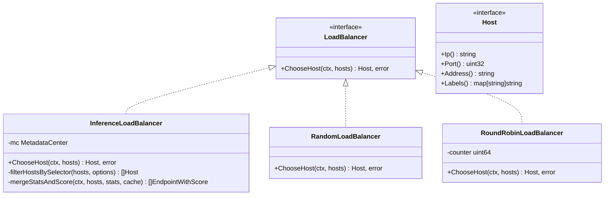

系统支持多种负载均衡算法，通过配置的 `algorithm` 字段选择：

| 算法 | 说明 | 适用场景 |
|------|------|----------|
| `inference_lb` | 多维度评分算法（默认） | LLM 推理场景，需要负载感知和缓存感知 |
| `random` | 随机选择 | 简单场景，或 Metadata-Center 不可用时的降级 |
| `round_robin` | 轮询选择 | 需要严格均匀分发的场景 |

#### InferenceLoadBalancer 处理流程

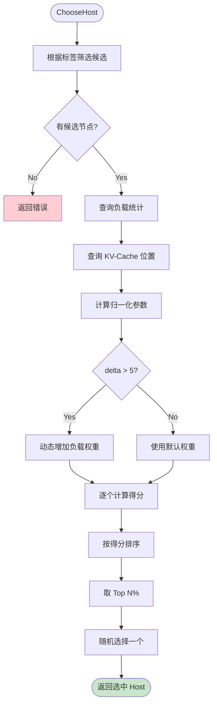

**流程说明**：

1. **标签筛选**：如果请求指定了 LoRA 适配器或其他标签选择器，首先过滤出匹配的候选节点
2. **负载查询**：向 Metadata-Center 发起同步请求，获取各节点的 `queuedReqs` 和 `promptLength`
3. **缓存查询**：根据 Prompt Hash 查询各节点的缓存命中情况
4. **归一化计算**：将原始指标归一化到 [0, 1] 区间，便于统一计算
5. **动态权重**：如果节点间负载差异大（delta > 5），增加负载权重以更积极地负载均衡
6. **得分计算**：对每个候选节点计算综合得分
7. **Top N 选择**：取得分最高的 N% 节点（避免总是选同一个导致热点）
8. **随机选择**：从 Top N 中随机选择一个（避免惊群效应）

### 4.3 Metadata Client 模块 (pkg/metadata/)

#### 职责

Metadata Client 模块负责与 Metadata-Center 服务通信，管理负载统计和缓存位置数据。

#### 架构设计

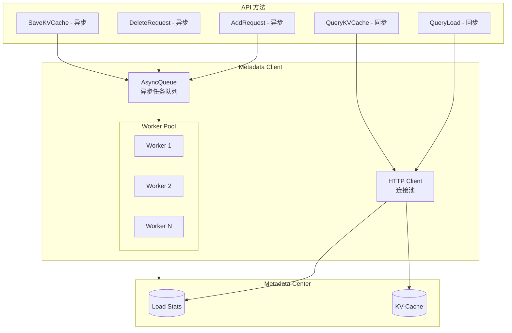

**设计要点**：

1. **连接池**：HTTP Client 维护连接池，复用 TCP 连接减少延迟
2. **同步/异步分离**：查询操作同步执行（负载均衡决策依赖），更新操作异步执行（不阻塞请求）
3. **Worker Pool**：异步队列使用固定数量的 Worker 协程处理任务，避免协程爆炸
4. **超时控制**：所有操作都有超时保护，避免 Metadata-Center 故障拖垮整个系统

#### API 接口

| 方法 | HTTP | 路径 | 同步/异步 | 说明 |
|------|------|------|-----------|------|
| `QueryLoad` | GET | `/v1/load/stats?cluster={cluster}` | 同步 | 获取集群所有节点的负载统计 |
| `AddRequest` | POST | `/v1/load/stats` | 异步 | 请求开始时增加计数 |
| `DeleteRequest` | DELETE | `/v1/load/stats` | 异步 | 请求结束时减少计数 |
| `DeleteRequestPrompt` | DELETE | `/v1/load/prompt` | 异步 | 首 Token 到达时删除 Prompt 长度 |
| `QueryKVCache` | POST | `/v1/cache/query` | 同步 | 查询 Prompt Hash 对应的缓存位置 |
| `SaveKVCache` | POST | `/v1/cache/save` | 异步 | 保存新的缓存位置映射 |

#### 降级策略

当 Metadata-Center 不可用或响应超时时，系统会自动降级：

| 场景 | 降级行为 | 影响 |
|------|----------|------|
| QueryLoad 失败 | 返回空统计，所有节点视为负载相等 | 退化为基于缓存的选择 |
| QueryKVCache 失败 | 返回空缓存，所有节点命中率为 0 | 退化为基于负载的选择 |
| 两者都失败 | 所有节点得分相同 | 退化为随机选择 |
| 更新操作失败 | 记录警告日志，不影响请求 | 统计可能不准确 |

### 4.4 Transcoder 模块 (pkg/transcoder/)

#### 职责

Transcoder 模块负责协议解析和转换，将不同格式的请求/响应转换为统一的内部表示。

#### 接口定义

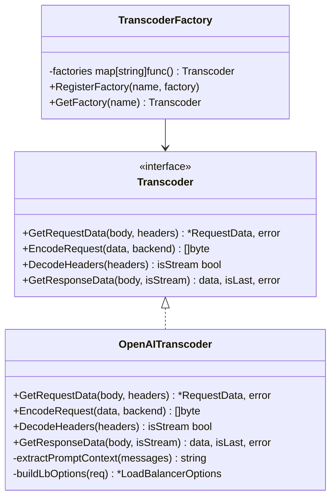

#### 接口方法说明

| 方法 | 输入 | 输出 | 说明 |
|------|------|------|------|
| `GetRequestData` | 请求体、请求头 | RequestData | 解析请求，提取模型名、Prompt 内容等 |
| `EncodeRequest` | RequestData、后端类型 | 编码后的请求体 | 将请求转换为后端期望的格式 |
| `DecodeHeaders` | 响应头 | 是否流式 | 判断响应是流式（SSE）还是非流式（JSON） |
| `GetResponseData` | 响应体、是否流式 | 数据、是否结束 | 解析响应数据，处理流式分块 |

#### OpenAI Transcoder 实现

OpenAI Transcoder 处理标准的 OpenAI Chat Completion API 格式：

**支持的请求格式**：

```json
// 标准文本请求
{
  "model": "qwen-2.5-72b",
  "messages": [
    {"role": "system", "content": "You are a helpful assistant."},
    {"role": "user", "content": "What is AI?"}
  ],
  "stream": true
}

// VL 多模态请求
{
  "model": "qwen-vl-plus",
  "messages": [
    {
      "role": "user",
      "content": [
        {"type": "text", "text": "What's in this image?"},
        {"type": "image_url", "image_url": {"url": "https://..."}}
      ]
    }
  ]
}
```

**Prompt 提取逻辑**：遍历所有消息，提取 `content` 字段中的文本内容。对于多模态请求，只提取 `type: "text"` 的部分。

**后端适配**：根据 `backend` 配置决定是否需要格式转换：
- `vllm`、`sglang`：直接透传 OpenAI 格式
- `triton`：转换为 Triton Inference Server 格式

### 4.5 Hash 模块 (pkg/hash/)

#### 职责

Hash 模块负责计算 Prompt 的分块哈希，用于缓存感知路由。

#### 算法说明

采用 **MurmurHash3** 算法，这是一种高性能的非加密哈希函数，具有以下特点：
- 计算速度快，适合大量文本处理
- 分布均匀，碰撞率低
- 确定性输出，相同输入总是产生相同哈希

#### 分块策略

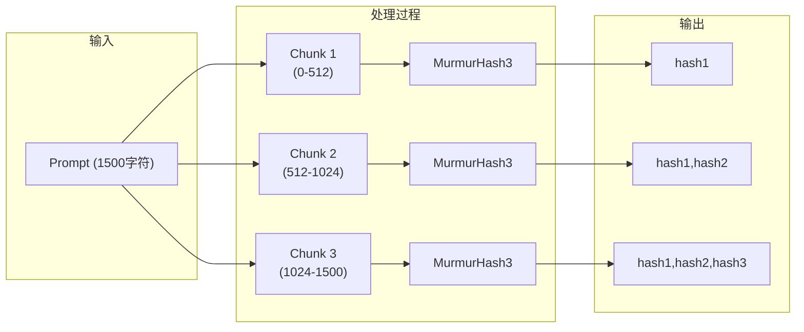

**配置参数**：
- `chunkSize`：每块的字符数，默认 512
- 块大小的选择需要平衡精度和性能：太小会产生过多哈希，太大会降低前缀匹配精度

**累积格式的优势**：
- 支持高效的前缀匹配：只需比较数组元素
- 存储紧凑：每个累积哈希包含了前面所有块的信息
- 查询简单：在 Metadata-Center 中可以直接用数组元素作为 key

### 4.6 Config 模块 (pkg/config/)

#### 职责

Config 模块负责配置解析和验证，将 EnvoyFilter 中的 JSON 配置转换为内部数据结构。

#### 配置结构

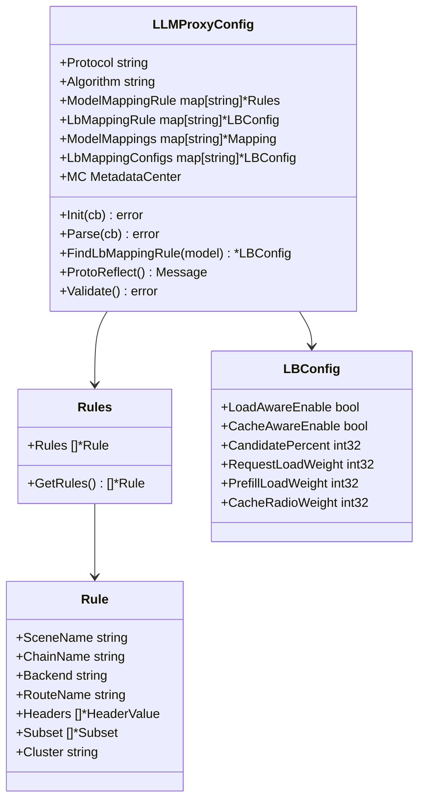

#### 配置字段说明

**LLMProxyConfig**：

| 字段 | 类型 | 必填 | 说明 |
|------|------|------|------|
| `protocol` | string | 是 | 输入协议类型，目前支持 `openai` |
| `algorithm` | string | 否 | 负载均衡算法，默认 `inference_lb` |
| `model_mapping_rule` | map | 是 | 模型到路由规则的映射 |
| `lb_mapping_rule` | map | 否 | 模型到 LB 配置的映射 |

**Rule**：

| 字段 | 类型 | 说明 |
|------|------|------|
| `scene_name` | string | 场景名称，用于日志和指标 |
| `backend` | string | 后端类型：`vllm`、`sglang`、`triton` |
| `headers` | []HeaderValue | Header 匹配条件，用于条件路由 |
| `cluster` | string | 目标 Istio 集群名称 |

**LBConfig**：

| 字段 | 类型 | 默认值 | 说明 |
|------|------|--------|------|
| `load_aware_enable` | bool | true | 是否启用负载感知 |
| `cache_aware_enable` | bool | true | 是否启用缓存感知 |
| `candidate_percent` | int32 | 10 | Top N% 候选比例 |
| `request_load_weight` | int32 | 1 | W2 权重 |
| `prefill_load_weight` | int32 | 3 | W3 权重 |
| `cache_radio_weight` | int32 | 2 | W1 权重 |

#### 路由匹配逻辑

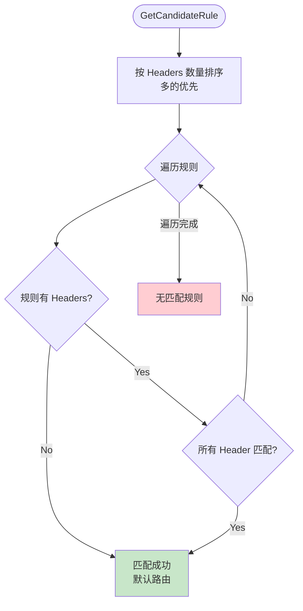

**匹配优先级**：
1. 规则按 Headers 数量降序排序，更具体的规则优先匹配
2. 遍历规则，检查所有 Header 条件
3. 如果一个规则的所有 Header 条件都满足，立即返回该规则
4. 没有 Headers 的规则作为默认路由（最后匹配）

**示例**：假设配置了三条规则：
- 规则 A：`headers: [{x-env: prod}, {x-region: us}]`
- 规则 B：`headers: [{x-env: prod}]`
- 规则 C：`headers: []`（默认）

对于请求 `x-env: prod, x-region: us`，匹配顺序是 A → B → C，最终匹配规则 A。

---

## 5. 数据结构

### 5.1 请求上下文

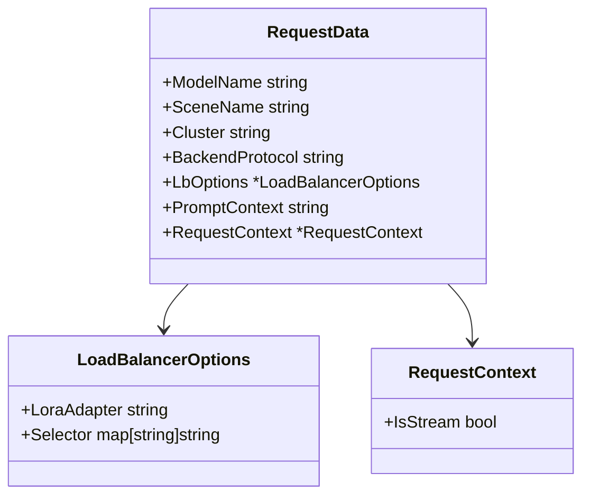

**RequestData** 是 Transcoder 解析请求后返回的结构化数据，包含了负载均衡决策所需的所有信息：

| 字段 | 说明 | 示例值 |
|------|------|--------|
| `ModelName` | 客户端请求的模型名称 | `"qwen-2.5-72b"` |
| `SceneName` | 场景名称（从路由规则获取） | `"prod-qwen"` |
| `Cluster` | 目标集群名称 | `"outbound\|8000\|\|vllm-service"` |
| `BackendProtocol` | 后端协议类型 | `"vllm"` |
| `PromptContext` | 提取的 Prompt 文本内容 | `"请用 Python 实现..."` |
| `LbOptions` | 负载均衡选项（LoRA、标签选择器） | `{LoraAdapter: "lora-v1"}` |
| `RequestContext` | 请求上下文（是否流式） | `{IsStream: true}` |

### 5.2 负载统计

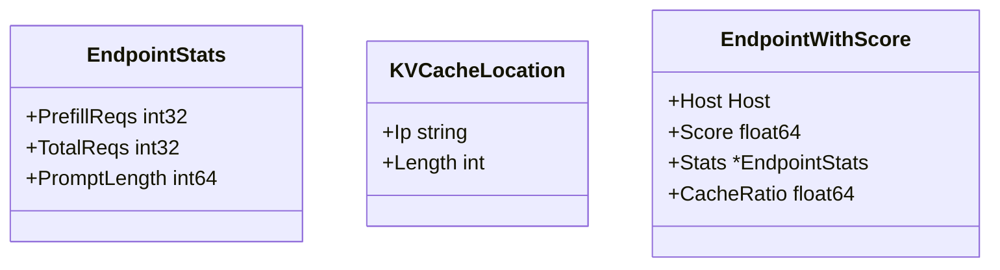

**EndpointStats** 是从 Metadata-Center 获取的单个节点负载数据：

| 字段 | 说明 | 更新时机 |
|------|------|----------|
| `TotalReqs` | 当前排队的请求总数 | 请求开始 +1，请求结束 -1 |
| `PromptLength` | 排队请求的 Prompt 总长度 | 请求开始 +len，首 Token -len |
| `PrefillReqs` | Prefill 阶段的请求数（保留字段） | 暂未使用 |

**KVCacheLocation** 是缓存位置查询的返回结果：

| 字段 | 说明 |
|------|------|
| `Ip` | 缓存所在节点的 IP 地址 |
| `Length` | 匹配的哈希块数（用于计算命中率） |

**EndpointWithScore** 是评分计算的中间结果，用于排序和选择：

| 字段 | 说明 |
|------|------|
| `Host` | 候选节点 |
| `Score` | 计算出的综合得分 |
| `Stats` | 该节点的负载统计 |
| `CacheRatio` | 该节点的缓存命中率 |

### 5.3 Context Keys

Context 是 Go 语言中传递请求范围数据的标准方式。我们定义了一组 Context Key 用于在 Filter 和 LoadBalancer 之间传递数据：

| Key | 类型 | 说明 |
|-----|------|------|
| `KeyTraceId` | string | 请求追踪 ID |
| `KeyModelName` | string | 模型名称 |
| `KeyClusterName` | string | 目标集群名称 |
| `KeyPromptHash` | []string | Prompt 哈希数组 |
| `KeyPromptLength` | int | Prompt 长度（Token 数或字符数） |
| `KeyCandidatePercent` | int32 | Top N% 候选比例 |
| `KeyCacheRatioWeight` | int32 | W1 权重 |
| `KeyRequestLoadWeight` | int32 | W2 权重 |
| `KeyPrefillLoadWeight` | int32 | W3 权重 |
| `KeyLoadAwareEnable` | bool | 是否启用负载感知 |
| `KeyCacheAwareEnable` | bool | 是否启用缓存感知 |
| `KeyLbOptions` | *LoadBalancerOptions | 负载均衡选项 |

**默认权重值**：
- `DefaultCacheRatioWeight` = 2
- `DefaultRequestLoadWeight` = 1
- `DefaultPrefillLoadWeight` = 3
- `DefaultCandidatePercent` = 10

---

## 6. 部署架构

### 6.1 组件部署图

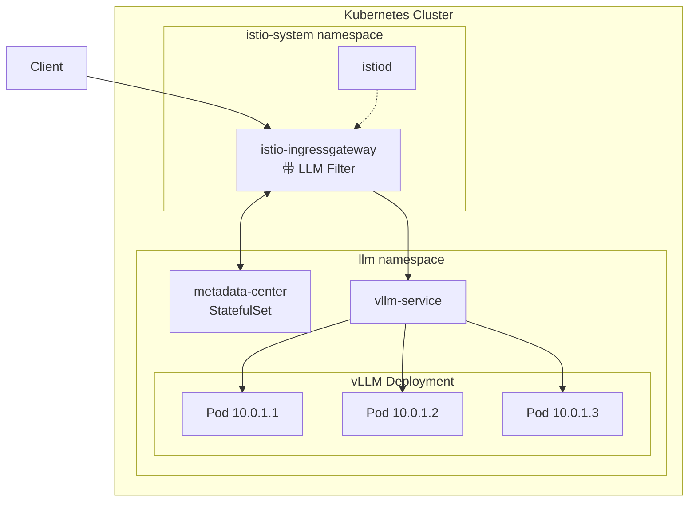

**部署组件说明**：

1. **istio-ingressgateway**：Istio 的入口网关，需要挂载 LLM Proxy Filter 的 `.so` 文件。通过 Volume 挂载或自定义镜像的方式部署。

2. **istiod**：Istio 控制平面，负责将 EnvoyFilter 配置下发到 Gateway。

3. **metadata-center**：建议部署为 StatefulSet，确保重启后保留统计数据。可以使用 Redis 作为后端存储提高可靠性。

4. **vLLM Deployment**：推理服务部署，每个 Pod 运行一个 vLLM 实例。建议配置 GPU 亲和性和反亲和性规则。

5. **vllm-service**：Kubernetes Service，Filter 通过服务名解析获取后端 Pod 列表。

### 6.2 EnvoyFilter 配置

完整的 EnvoyFilter 配置示例：

```yaml
apiVersion: networking.istio.io/v1alpha3
kind: EnvoyFilter
metadata:
  name: llm-proxy-filter
  namespace: istio-system
spec:
  workloadSelector:
    labels:
      istio: ingressgateway
  configPatches:
    - applyTo: HTTP_FILTER
      match:
        context: GATEWAY
        listener:
          filterChain:
            filter:
              name: envoy.filters.network.http_connection_manager
              subFilter:
                name: envoy.filters.http.router
      patch:
        operation: INSERT_BEFORE
        value:
          name: envoy.filters.http.golang
          typed_config:
            "@type": type.googleapis.com/envoy.extensions.filters.http.golang.v3alpha.Config
            library_id: llm-proxy
            library_path: /etc/envoy/libllmproxy.so
            plugin_name: fm
            plugin_config:
              "@type": type.googleapis.com/xds.type.v3.TypedStruct
              value:
                plugins:
                  - name: llm-proxy
                    config:
                      protocol: openai
                      algorithm: inference_lb
                      model_mapping_rule:
                        qwen-2.5-72b:
                          rules:
                            - scene_name: qwen-prod
                              cluster: outbound|8000||vllm-service.llm.svc.cluster.local
                              backend: vllm
                              headers:
                                - key: x-env
                                  value: prod
                            - scene_name: qwen-default
                              cluster: outbound|8000||vllm-service.llm.svc.cluster.local
                              backend: vllm
                      lb_mapping_rule:
                        qwen-2.5-72b:
                          load_aware_enable: true
                          cache_aware_enable: true
                          candidate_percent: 10
                          request_load_weight: 1
                          prefill_load_weight: 3
                          cache_radio_weight: 2
```

**配置说明**：

- `workloadSelector`：选择要注入 Filter 的工作负载，这里选择 Istio Ingress Gateway
- `applyTo: HTTP_FILTER`：在 HTTP Filter 链中注入
- `INSERT_BEFORE router`：在 Router Filter 之前执行，确保能修改路由目标
- `library_path`：Filter `.so` 文件的路径，需要通过 Volume 挂载到容器中
- `plugin_name: fm`：使用 FilterManager 管理插件
- `model_mapping_rule`：按模型名配置路由规则，支持 Header 条件匹配
- `lb_mapping_rule`：按模型名配置负载均衡参数

### 6.3 环境变量配置

Filter 通过环境变量配置 Metadata-Center 连接参数：

| 变量 | 说明 | 默认值 |
|------|------|--------|
| `METADATA_CENTER_HOST` | Metadata-Center 服务地址 | localhost |
| `METADATA_CENTER_PORT` | Metadata-Center 服务端口 | 8080 |
| `METADATA_CENTER_ENABLED` | 是否启用 Metadata-Center | false |
| `METADATA_CENTER_CACHE_ENABLED` | 是否启用缓存感知路由 | false |
| `METADATA_CENTER_TIMEOUT_MS` | 同步请求超时时间（毫秒） | 100 |
| `METADATA_CENTER_ASYNC_TIMEOUT_MS` | 异步请求超时时间（毫秒） | 500 |
| `METADATA_CENTER_ASYNC_QUEUE_SIZE` | 异步任务队列大小 | 1000 |
| `METADATA_CENTER_ASYNC_WORKERS` | 异步工作协程数量 | 10 |

**配置建议**：

- `TIMEOUT_MS` 设置为 100ms 以内，避免影响请求延迟
- `ASYNC_QUEUE_SIZE` 根据 QPS 调整，确保队列不会溢出
- `ASYNC_WORKERS` 根据 Metadata-Center 的处理能力调整

---

## 7. 扩展性设计

### 7.1 新增负载均衡算法

系统支持通过工厂模式扩展负载均衡算法：

```go
// 1. 实现 LoadBalancer 接口
type MyLoadBalancer struct {}

func (lb *MyLoadBalancer) ChooseHost(ctx context.Context, hosts []types.Host) (types.Host, error) {
    // 自定义选择逻辑
    // 可以从 ctx 获取 PromptHash、权重配置等信息
    return selectedHost, nil
}

// 2. 在 init 函数中注册
func init() {
    loadbalancer.RegisterLbType("my_lb", func() types.LoadBalancer {
        return &MyLoadBalancer{}
    })
}

// 3. 在配置中使用
// "algorithm": "my_lb"
```

### 7.2 新增协议支持

系统支持通过工厂模式扩展协议转码器：

```go
// 1. 实现 Transcoder 接口
type AnthropicTranscoder struct {}

func (t *AnthropicTranscoder) GetRequestData(body []byte, headers api.RequestHeaderMap) (*types.RequestData, error) {
    // 解析 Anthropic Claude API 格式
    // 提取 model、messages 等字段
    return &types.RequestData{...}, nil
}

func (t *AnthropicTranscoder) EncodeRequest(data *types.RequestData, backend string) []byte {
    // 转换为后端格式
    return encodedBody
}

// 2. 在 init 函数中注册
func init() {
    transcoder.RegisterFactory("anthropic", func() transcoder.Transcoder {
        return &AnthropicTranscoder{}
    })
}

// 3. 在配置中使用
// "protocol": "anthropic"
```

### 7.3 新增后端类型

在 Transcoder 的 `EncodeRequest` 方法中添加新的后端类型处理：

```go
func (t *OpenAITranscoder) EncodeRequest(data *types.RequestData, backend string) []byte {
    switch backend {
    case "vllm", "sglang":
        // 直接透传 OpenAI 格式
        return data.RawBody
    case "triton":
        // 转换为 Triton Inference Server 格式
        return t.convertToTritonFormat(data)
    case "trt-llm":
        // 转换为 TensorRT-LLM 格式
        return t.convertToTrtLlmFormat(data)
    default:
        return data.RawBody
    }
}
```

---

## 8. 监控与可观测性

### 8.1 日志输出

Filter 在关键节点输出结构化日志，便于问题排查和性能分析：

```
[INFO] [TraceID: abc123] DecodeRequest: model=qwen-2.5-72b, promptLen=1024
[INFO] [TraceID: abc123] LoadBalancer: candidates=3, selected=10.0.1.2, score=0.85
[INFO] [TraceID: abc123] EncodeHeaders: stream=true, cacheHit=66.7%
[INFO] [TraceID: abc123] FirstToken: ttft=150ms
[INFO] [TraceID: abc123] OnLog: duration=2.5s, status=200
```

**日志字段说明**：

| 字段 | 说明 |
|------|------|
| `TraceID` | 请求追踪 ID，用于关联同一请求的所有日志 |
| `model` | 请求的模型名称 |
| `promptLen` | Prompt 长度（字符数或 Token 数） |
| `candidates` | 候选后端数量 |
| `selected` | 选中的后端 IP |
| `score` | 选中节点的得分 |
| `stream` | 是否为流式响应 |
| `cacheHit` | 缓存命中率 |
| `ttft` | 首 Token 延迟 |
| `duration` | 总请求时长 |
| `status` | HTTP 状态码 |

### 8.2 指标（规划中）

计划暴露以下 Prometheus 指标：

| 指标名 | 类型 | 说明 |
|--------|------|------|
| `llm_request_total` | Counter | 请求总数，按 model、status 分组 |
| `llm_request_duration_seconds` | Histogram | 请求延迟分布 |
| `llm_ttft_seconds` | Histogram | 首 Token 延迟分布 |
| `llm_cache_hit_ratio` | Gauge | 缓存命中率 |
| `llm_lb_score` | Gauge | 各节点的负载均衡得分 |
| `llm_endpoint_queue_depth` | Gauge | 各节点的队列深度 |

### 8.3 链路追踪

通过 TraceID 可以串联完整的请求链路：

1. 客户端设置 `x-request-id` Header
2. Filter 读取或生成 TraceID
3. TraceID 传递给 Metadata-Center 用于日志关联
4. TraceID 随请求传递到后端推理服务
5. 所有组件的日志都包含 TraceID，便于端到端排查

---

## 9. 附录

### 9.1 术语表

| 术语 | 英文 | 说明 |
|------|------|------|
| KV-Cache | Key-Value Cache | Transformer 中存储历史 Token 的 Key/Value 向量的缓存 |
| Prefill | Prefill Phase | LLM 推理的第一阶段，处理输入 Prompt 并生成 KV-Cache |
| Decode | Decode Phase | LLM 推理的第二阶段，逐个生成输出 Token |
| TTFT | Time To First Token | 从请求发出到收到第一个生成 Token 的时间 |
| LoRA | Low-Rank Adaptation | 一种轻量级的模型微调技术，允许快速切换适配器 |
| SSE | Server-Sent Events | 服务器推送事件，用于流式响应 |

### 9.2 参考文档

- [Envoy Golang Filter 文档](https://www.envoyproxy.io/docs/envoy/latest/configuration/http/http_filters/golang_filter)
- [HTNN Filter 框架](https://github.com/mosn/htnn)
- [vLLM 文档](https://docs.vllm.ai/)
- [Istio EnvoyFilter 配置](https://istio.io/latest/docs/reference/config/networking/envoy-filter/)
- [OpenAI API 规范](https://platform.openai.com/docs/api-reference)
- [Mermaid 图表语法](https://mermaid.js.org/)
