# 执行流程图

本文档详细描述 istio-llm-filter 的请求处理流程、负载均衡评分算法和各组件交互时序。

---

## 1. 总体请求流程

### 1.1 完整请求生命周期

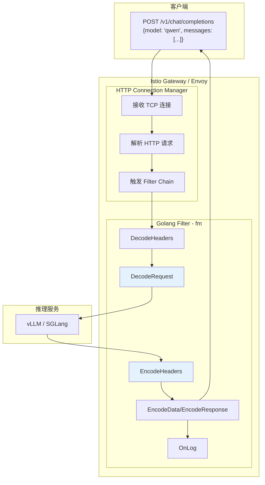

上图展示了一个 LLM 请求的完整生命周期，从客户端发起到最终返回响应的全过程：

**客户端层**：用户通过 OpenAI 兼容的 SDK 或 HTTP 客户端发起 POST 请求，请求体包含模型名称（`model`）和对话消息（`messages`）。

**网关层 - HTTP Connection Manager**：
1. Envoy 接收来自客户端的 TCP 连接
2. HTTP 协议解析器将原始字节流解析为 HTTP 请求对象
3. 根据配置的 Filter Chain 依次调用各个 HTTP Filter

**网关层 - Golang Filter**：
1. `DecodeHeaders`：收到请求头时被调用，返回 `WaitAllData` 信号等待完整请求体
2. `DecodeRequest`：收到完整请求后执行核心处理逻辑（解析、路由、负载均衡）
3. 请求被转发到选中的后端 Pod
4. `EncodeHeaders`：收到响应头时被调用，保存缓存位置并判断响应类型
5. `EncodeData`/`EncodeResponse`：处理响应体（流式或非流式）
6. `OnLog`：请求结束时执行清理和日志记录

**后端层**：vLLM/SGLang 等推理服务执行实际的 LLM 推理，返回生成结果。

### 1.2 Filter 生命周期状态机

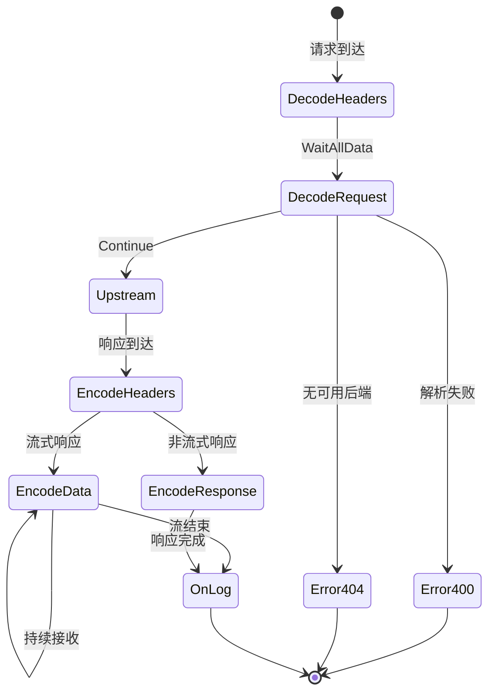

Filter 的生命周期是一个状态机，有以下几个关键状态转换：

**正常流程**：
- `DecodeHeaders → DecodeRequest`：返回 `WaitAllData` 后，Envoy 缓冲完整请求体再调用 `DecodeRequest`
- `DecodeRequest → Upstream`：返回 `Continue` 后，请求被转发到上游服务
- `Upstream → EncodeHeaders`：后端返回响应头时触发
- `EncodeHeaders → EncodeData`：流式响应时，每个 SSE 数据块触发一次 `EncodeData`
- `EncodeHeaders → EncodeResponse`：非流式响应时，等待完整响应体后触发
- `*Response → OnLog`：响应处理完成后执行清理

**错误流程**：
- `DecodeRequest → Error400`：请求解析失败（JSON 格式错误、模型未找到等）
- `DecodeRequest → Error404`：无可用后端（集群为空、标签筛选无匹配等）

---

## 2. DecodeHeaders 阶段

### 2.1 流程图

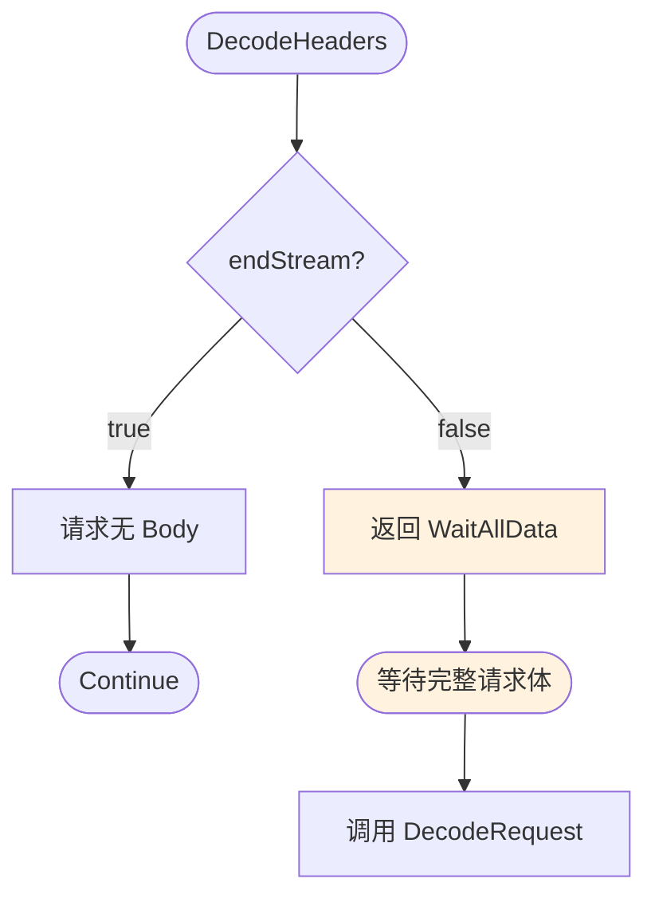

`DecodeHeaders` 是 Filter 处理请求的第一个入口点，主要职责是决定是否需要等待请求体。

**参数说明**：
- `headers`：HTTP 请求头的映射对象，可以读取 Content-Type、Authorization 等
- `endStream`：布尔值，表示请求头之后是否还有数据（Body）

**处理逻辑**：
1. 检查 `endStream` 参数
2. 如果 `endStream=true`，表示请求没有 Body（如 GET 请求），直接返回 `Continue`
3. 如果 `endStream=false`，表示请求有 Body（如 POST 请求），返回 `WaitAllData`

**返回值说明**：
- `Continue`：继续执行 Filter Chain，请求直接转发
- `WaitAllData`：等待 Envoy 缓冲完整请求体，然后调用 `DecodeRequest`

对于 LLM 请求，几乎所有情况都是 POST 请求带有 JSON Body，因此通常返回 `WaitAllData`。

---

## 3. DecodeRequest 阶段（核心处理）

### 3.1 详细流程图

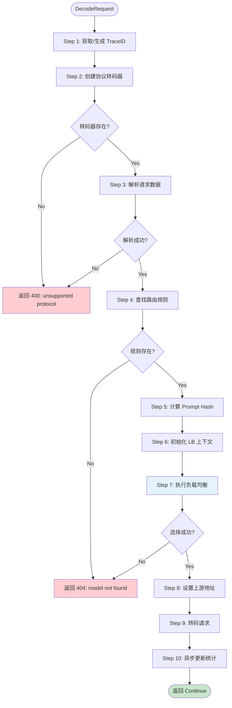

`DecodeRequest` 是整个 Filter 的核心，执行请求解析、路由决策和负载均衡。下面详细说明每个步骤：

#### Step 1: 获取/生成 TraceID

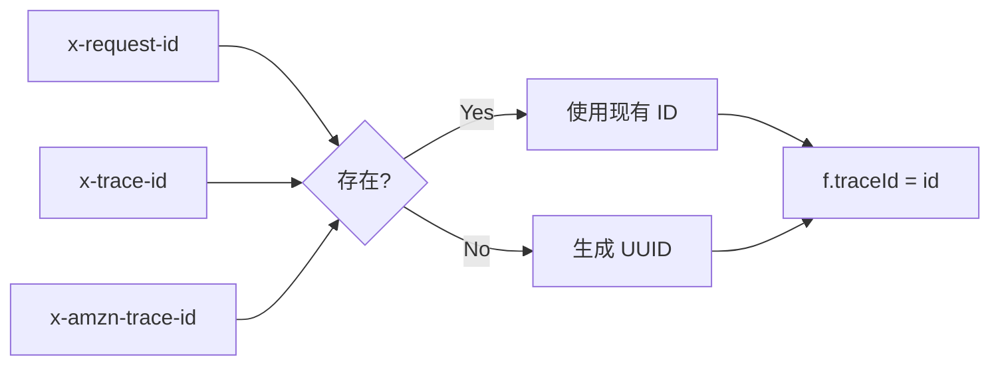

TraceID 用于在分布式系统中追踪请求的完整链路。处理逻辑：
1. 依次检查 `x-request-id`、`x-trace-id`、`x-amzn-trace-id` 请求头
2. 如果存在任一头部，使用其值作为 TraceID
3. 如果都不存在，生成新的 UUID
4. TraceID 会被记录在所有日志中，便于问题排查

#### Step 2: 创建协议转码器

根据配置的 `protocol` 字段（如 `openai`）从工厂获取对应的 Transcoder 实例。如果协议未注册，返回 400 错误。

目前支持的协议：
- `openai`：OpenAI Chat Completion API 格式

#### Step 3: 解析请求数据

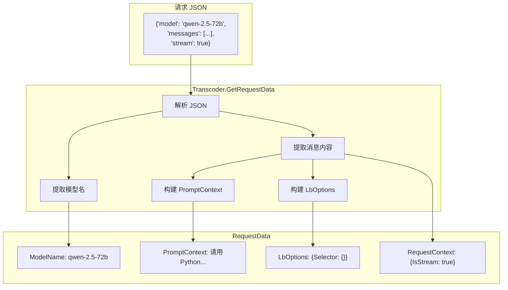

Transcoder 负责将原始 JSON 解析为结构化的 `RequestData` 对象：

**解析内容**：
- `model`：模型名称，用于查找路由规则
- `messages`：对话消息数组，提取所有文本内容作为 PromptContext
- `stream`：是否请求流式响应
- 额外字段：LoRA 适配器名称、标签选择器等（如有）

**错误处理**：
- JSON 格式错误 → 返回 400
- 缺少必需字段（model）→ 返回 400

#### Step 4: 查找路由规则

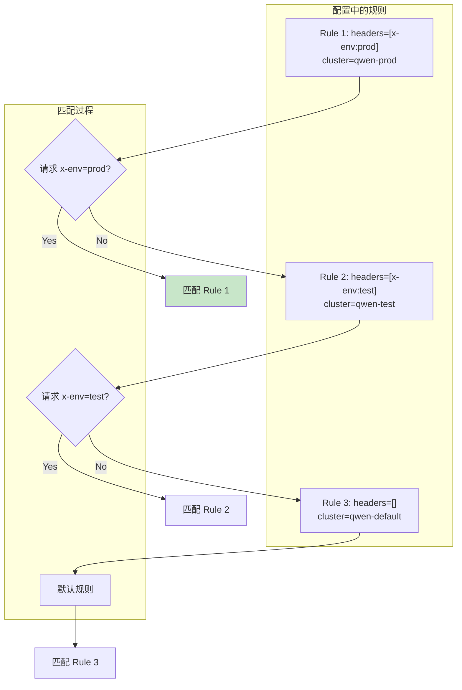

路由规则匹配是一个两级查找过程：

**第一级：模型名匹配**
根据解析出的模型名在 `model_mapping_rule` 中查找对应的规则列表。如果模型未配置，返回 404。

**第二级：Header 条件匹配**
规则按 Headers 数量降序排序，遍历规则列表：
1. 检查规则的所有 Header 条件是否满足
2. 第一个完全匹配的规则被选中
3. 没有 Header 条件的规则作为默认路由

**匹配结果**：
从选中的规则中提取：
- `cluster`：目标 Istio 集群名称
- `backend`：后端协议类型（vllm/sglang/triton）
- `scene_name`：场景名称（用于日志和指标）

#### Step 5: 计算 Prompt Hash

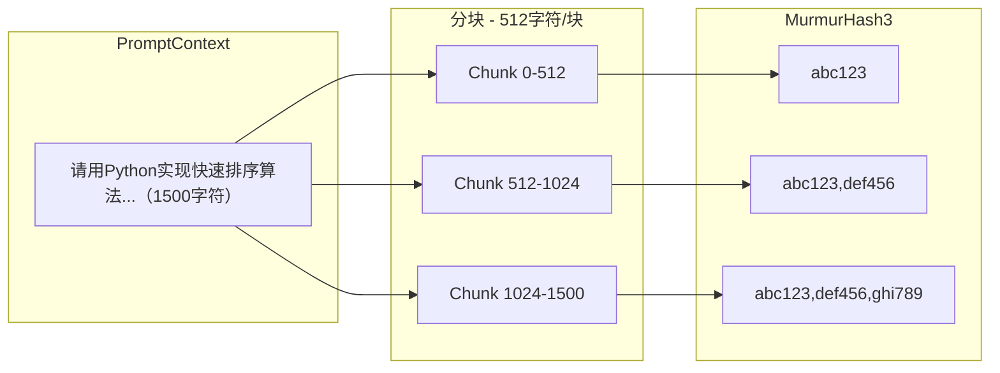

Prompt Hash 用于缓存感知路由，计算过程：

1. **分块**：将 PromptContext 按 512 字符分块
2. **哈希**：对每块使用 MurmurHash3 计算哈希值
3. **累积**：生成累积格式的哈希数组

**累积格式的作用**：
支持前缀匹配。例如，两个 Prompt 的哈希分别是：
- A: `["abc", "abc,def", "abc,def,ghi"]`
- B: `["abc", "abc,def", "abc,xyz"]`

通过比较数组元素，可以快速确定 B 与 A 有 2/3（66.7%）的前缀相同。

#### Step 6: 初始化 LB 上下文

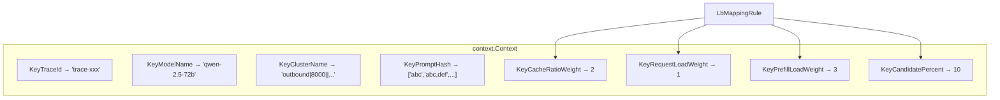

Go 的 Context 机制用于在组件间传递请求范围的数据。这里将以下信息注入 Context：

**请求相关**：
- TraceID：用于日志关联
- ModelName：模型名称
- ClusterName：目标集群
- PromptHash：Prompt 哈希数组
- PromptLength：Prompt 长度

**配置相关**（从 LbMappingRule 获取）：
- CacheRatioWeight (W1)：缓存命中权重
- RequestLoadWeight (W2)：请求负载权重
- PrefillLoadWeight (W3)：Prefill 负载权重
- CandidatePercent：Top N% 候选比例

#### Step 7: 执行负载均衡

这是整个流程中最关键的步骤，详见后面的"负载均衡评分流程"章节。

简要流程：
1. 从 Istio 获取目标集群的 Endpoint 列表
2. 根据标签选择器筛选候选节点
3. 查询 Metadata-Center 获取负载统计和缓存位置
4. 计算各节点得分并选择最优节点

#### Step 8: 设置上游地址

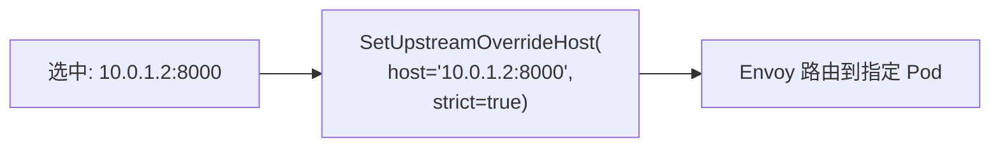

通过 Envoy 的 API 将请求定向转发到选中的后端：

**API 参数**：
- `host`：选中节点的完整地址（IP:Port）
- `strict=true`：强制路由到指定地址，如果失败则返回 503

**注意事项**：
- 地址必须是有效的 IP:Port 格式
- strict 模式确保请求一定发送到我们选择的节点
- 如果节点不可用，Envoy 不会 fallback 到其他节点

#### Step 9: 转码请求

根据目标后端类型，可能需要转换请求格式：

| 后端类型 | 处理方式 |
|----------|----------|
| `vllm` | 直接透传，vLLM 原生支持 OpenAI 格式 |
| `sglang` | 直接透传，SGLang 原生支持 OpenAI 格式 |
| `triton` | 转换为 Triton Inference Server 格式 |

#### Step 10: 异步更新统计

```go
go f.addRequest()  // 在新协程中执行，不阻塞主流程
```

向 Metadata-Center 报告新请求，更新统计数据：
- 增加目标节点的 `queuedReqs` 计数
- 增加目标节点的 `promptLength` 累计值

**为什么异步**：
- 统计更新不影响当前请求的处理
- 避免 Metadata-Center 响应慢时拖慢请求
- 即使更新失败也不影响请求正常处理

---

## 4. 负载均衡评分流程

### 4.1 完整评分流程

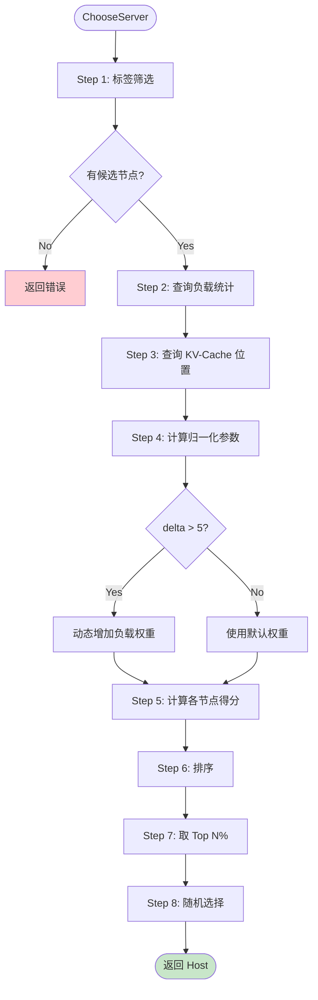

`ChooseServer` 是 `InferenceLoadBalancer` 的核心方法，实现多维度评分选择最优后端。

#### Step 1: 标签筛选

如果请求指定了 LoRA 适配器或其他标签选择器，首先过滤候选节点：

```go
candidates := filterHostsBySelector(endpoints, lbOptions)
```

筛选逻辑：遍历所有 Endpoint，保留标签完全匹配的节点。如果筛选后无候选节点，返回错误。

#### Step 2: 查询负载统计

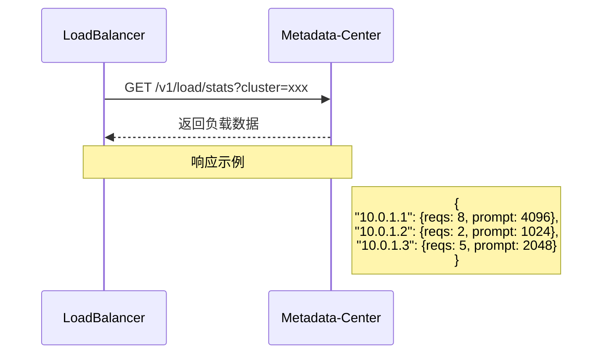

向 Metadata-Center 发起 **同步** HTTP 请求，获取目标集群中各节点的实时负载数据：

**请求**：`GET /v1/load/stats?cluster={cluster_name}`

**响应**：Map 结构，key 是节点 IP，value 是 EndpointStats：
- `total_reqs`：当前排队的请求数
- `prompt_length`：排队请求的 Prompt 总长度

**超时处理**：默认 100ms 超时，超时后使用空数据（所有节点视为负载相等）

#### Step 3: 查询 KV-Cache 位置

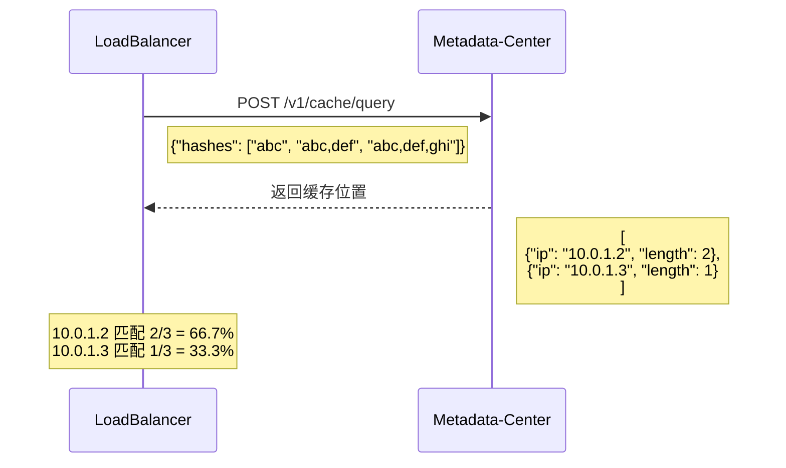

向 Metadata-Center 查询哪些节点缓存了相似的 Prompt：

**请求**：`POST /v1/cache/query`，Body 包含 Prompt 哈希数组

**响应**：数组，每个元素包含：
- `ip`：缓存所在节点
- `length`：匹配的哈希块数（最长公共前缀）

**缓存命中率计算**：`cacheRatio = length / len(promptHash)`

例如，哈希数组有 3 个元素，某节点匹配 2 个，则命中率 = 2/3 = 66.7%

#### Step 4: 计算归一化参数

为了让不同维度的指标可比较，需要进行归一化处理：

```go
// 找出最小和最大请求数
minReqs := min(allStats.TotalReqs)
maxReqs := max(allStats.TotalReqs)
delta := max(2, maxReqs - minReqs)  // 最小为2，避免除零

// 找出最大 Prompt 长度
maxPrompt := max(allStats.PromptLength)
```

**归一化公式**：
- `NormalizedReqLoad = (currentReqs - minReqs) / delta`
- `NormalizedPrefillLoad = currentPromptLen / maxPrompt`

归一化后，所有值都在 [0, 1] 区间内。

#### 动态权重调整

当节点间负载差异较大时（delta > 5），增加负载权重的影响：

```go
if delta > 5 {
    effectiveW2 = W2 * (delta / 5)
}
```

**设计原因**：
- 正常情况下，少量负载差异不需要过度反应
- 当差异很大时，应该更积极地避开高负载节点
- delta > 5 意味着最繁忙节点比最空闲节点多 5 个以上排队请求

#### Step 5: 计算各节点得分

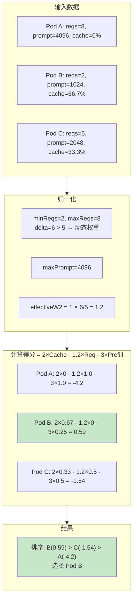

**得分公式**：
```
Score = W1 × CacheRatio - W2 × NormalizedReqLoad - W3 × NormalizedPrefillLoad
```

**各项含义**：
- `W1 × CacheRatio`：缓存命中的收益（正向）
- `W2 × NormalizedReqLoad`：请求队列深度的惩罚（负向）
- `W3 × NormalizedPrefillLoad`：Prefill 队列深度的惩罚（负向）

**示例计算（接上图）**：

Pod A (reqs=8, prompt=4096, cache=0%)：
- NormReq = (8-2)/6 = 1.0
- NormPrefill = 4096/4096 = 1.0
- Score = 2×0 - 1.2×1.0 - 3×1.0 = **-4.2**（最差：无缓存 + 高负载）

Pod B (reqs=2, prompt=1024, cache=66.7%)：
- NormReq = (2-2)/6 = 0.0
- NormPrefill = 1024/4096 = 0.25
- Score = 2×0.67 - 1.2×0 - 3×0.25 = **0.59**（最优：高缓存 + 低负载）

Pod C (reqs=5, prompt=2048, cache=33.3%)：
- NormReq = (5-2)/6 = 0.5
- NormPrefill = 2048/4096 = 0.5
- Score = 2×0.33 - 1.2×0.5 - 3×0.5 = **-1.54**（中等）

#### Step 6-8: 排序、Top N%、随机选择

```go
// 按得分降序排序
sort.Slice(scored, func(i, j int) bool {
    return scored[i].Score > scored[j].Score
})

// 取 Top N%（至少1个）
topN := max(1, len(scored) * candidatePercent / 100)

// 从 Top N 中随机选择
selected := scored[rand.Intn(topN)]
```

**为什么需要 Top N% + 随机**：
1. **避免惊群效应**：如果总是选最高分节点，短时间内所有请求都会涌向同一节点
2. **容错性**：如果最高分节点正好不可用，还有其他高分候选
3. **负载均衡**：在得分相近的节点间分散请求

**配置建议**：
- `candidate_percent = 10`：从 10 个节点中选 1 个
- `candidate_percent = 30`：从 10 个节点中选 3 个
- 值越小越倾向于选择最优，值越大越均匀

### 4.2 权重配置对比

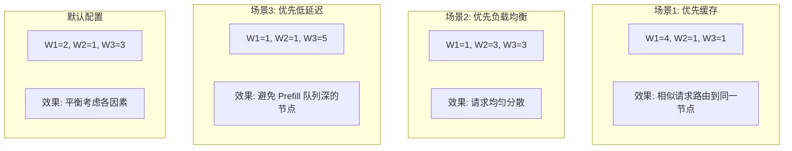

不同场景下的权重配置建议：

| 场景 | W1 | W2 | W3 | 适用情况 |
|------|----|----|-----|----------|
| 优先缓存 | 4 | 1 | 1 | 重复请求多，系统提示词固定 |
| 优先负载均衡 | 1 | 3 | 3 | 请求独立性高，缓存价值低 |
| 优先低延迟 | 1 | 1 | 5 | 对 TTFT 敏感的交互式应用 |
| 默认/平衡 | 2 | 1 | 3 | 通用场景 |

---

## 5. 响应处理流程

### 5.1 EncodeHeaders 阶段

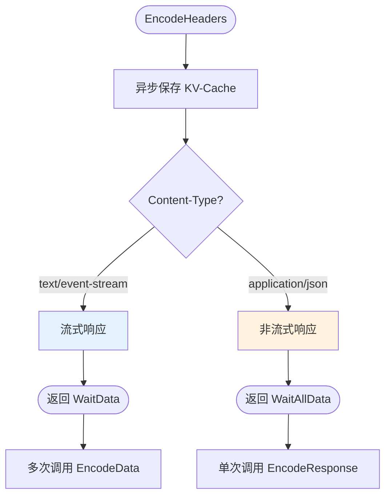

`EncodeHeaders` 在收到后端响应头时被调用，主要职责：

**1. 保存 KV-Cache 位置**
```go
go f.saveKVCache()  // 异步执行
```
将当前请求的 Prompt Hash 和处理节点 IP 保存到 Metadata-Center，供后续相似请求使用。

**2. 判断响应类型**
根据 Content-Type 头判断：
- `text/event-stream`：流式响应（SSE），返回 `WaitData`
- `application/json`：非流式响应，返回 `WaitAllData`

**返回值说明**：
- `WaitData`：流式模式，每收到一个数据块调用一次 `EncodeData`
- `WaitAllData`：等待完整响应体，然后调用 `EncodeResponse`

### 5.2 流式响应处理 (EncodeData)

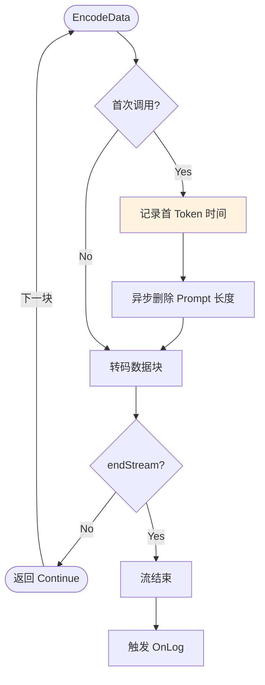

`EncodeData` 处理流式响应的每个数据块：

**首 Token 检测**
首次调用时记录 `firstTokenTime`，计算 TTFT（Time To First Token）。这是 LLM 应用的关键性能指标。

**删除 Prompt 长度**
首 Token 到达意味着 Prefill 阶段完成，异步更新 Metadata-Center：
```go
go f.deletePromptLength()  // 减少该节点的 promptLength 统计
```

**SSE 数据格式**
```
data: {"id":"chatcmpl-xxx","choices":[{"delta":{"content":"Hello"}}]}\n\n
data: {"id":"chatcmpl-xxx","choices":[{"delta":{"content":" World"}}]}\n\n
data: [DONE]\n\n
```

每行以 `data: ` 开头，以 `\n\n` 结尾。最后一条是 `[DONE]` 标记。

### 5.3 非流式响应处理 (EncodeResponse)

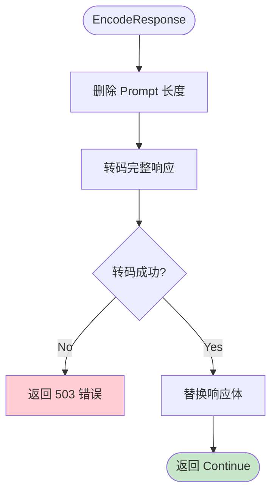

`EncodeResponse` 处理非流式的完整响应：

**处理步骤**：
1. 删除 Prompt 长度统计（响应返回意味着 Prefill 完成）
2. 调用 Transcoder 转码响应体（如有需要）
3. 如果转码失败，返回 503 错误
4. 替换响应体内容，返回 `Continue`

**JSON 响应格式**
```json
{
  "id": "chatcmpl-xxx",
  "object": "chat.completion",
  "choices": [{"message": {"role": "assistant", "content": "..."}}],
  "usage": {"prompt_tokens": 100, "completion_tokens": 50}
}
```

---

## 6. OnLog 清理阶段

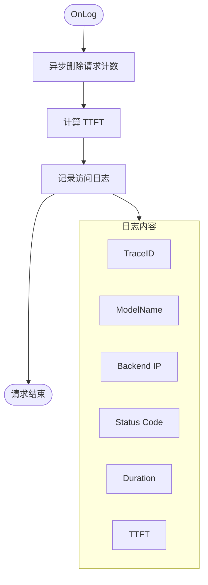

`OnLog` 在请求完全结束时被调用，执行清理和记录：

**1. 删除请求计数**
```go
go f.decreaseRequest()  // 减少该节点的 queuedReqs 统计
```
这是请求生命周期的最后一步，将统计计数恢复。

**2. 计算 TTFT**
```go
ttft := f.firstTokenTime.Sub(f.requestStartTime)
```
TTFT（Time To First Token）是从请求开始到收到第一个生成 Token 的时间，是 LLM 应用的关键性能指标。

**3. 记录访问日志**
```go
api.LogInfof("[TraceID: %s] completed: model=%s, backend=%s, status=%d, duration=%dms, ttft=%dms",
    f.traceId, f.modelName, f.serverIp, statusCode, duration.Milliseconds(), ttft.Milliseconds())
```

---

## 7. Metadata-Center 交互时序图

### 7.1 完整请求时序

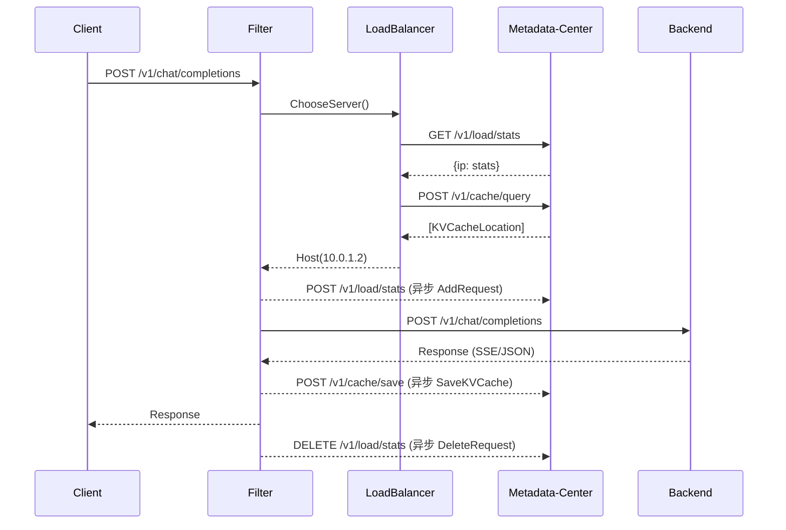

上图展示了一个请求中 Filter 与 Metadata-Center 的所有交互：

**同步交互（负载均衡决策依赖）**：
1. `GET /v1/load/stats`：获取负载统计
2. `POST /v1/cache/query`：查询缓存位置

**异步交互（不阻塞请求处理）**：
3. `POST /v1/load/stats`：AddRequest，请求开始时
4. `POST /v1/cache/save`：SaveKVCache，响应返回时
5. `DELETE /v1/load/stats`：DeleteRequest，请求结束时

### 7.2 异步队列处理

```mermaid
flowchart TB
    subgraph MainThread[主请求协程]
        M1[处理请求]
        M2["Dispatch(task)"]
        M3[继续处理]
        M4[响应返回]
    end
    
    subgraph AsyncQueue[异步队列]
        Q[Task Channel]
    end
    
    subgraph Workers[Worker Pool]
        W1[Worker 1]
        W2[Worker 2]
        W3[Worker N]
    end
    
    subgraph MC[Metadata-Center]
        API[HTTP API]
    end
    
    M1 --> M2
    M2 -->|非阻塞| Q
    M2 --> M3 --> M4
    
    Q --> W1 & W2 & W3
    W1 & W2 & W3 --> API
```

异步队列的设计目的是将统计更新与请求处理解耦：

**主请求协程**：
- 调用 `Dispatch(task)` 将任务放入队列
- 立即返回，继续处理请求
- 不等待任务执行完成

**异步队列**：
- 使用有缓冲的 Channel 作为任务队列
- 多个 Worker 协程并发消费任务
- 每个任务有独立的超时控制

**异步任务类型**：

| 任务 | 触发时机 | 作用 |
|------|----------|------|
| `addRequest` | 请求开始 | 增加排队计数 + Prompt 长度 |
| `deletePromptLength` | 首 Token 到达 | 删除 Prompt 长度（Prefill 完成） |
| `decreaseRequest` | 请求结束 | 减少排队计数 |
| `saveKVCache` | 响应返回 | 保存缓存位置映射 |

---

## 8. 错误处理流程

### 8.1 错误类型分类

```mermaid
flowchart TB
    subgraph E400[400 Bad Request]
        B1[JSON 解析失败]
        B2[模型名为空]
        B3[不支持的协议]
        B4[路由规则未找到]
    end
    
    subgraph E404[404 Not Found]
        N1[无可用后端]
        N2[标签选择器无匹配]
        N3[集群不存在]
    end
    
    subgraph E503[503 Service Unavailable]
        S1[后端响应解析失败]
        S2[后端返回错误]
        S3[响应转码失败]
    end
    
    style E400 fill:#ffcdd2
    style E404 fill:#ffe0b2
    style E503 fill:#ffccbc
```

Filter 可能返回三类错误响应：

**400 Bad Request**：客户端请求有问题
- JSON 格式错误
- 缺少必需字段（如 model）
- 请求的协议类型不支持
- 模型未在配置中定义

**404 Not Found**：找不到可用的后端
- 目标集群没有 Endpoint
- 标签选择器筛选后无匹配节点
- Istio 路由配置错误

**503 Service Unavailable**：后端服务问题
- 后端返回非 2xx 响应
- 后端响应格式解析失败
- 响应转码过程出错

### 8.2 错误响应格式

所有错误响应使用统一的 JSON 格式：

```json
{
  "error": {
    "code": 400,
    "type": "bad_request",
    "message": "invalid JSON: unexpected end of input"
  },
  "trace_id": "abc123"
}
```

**字段说明**：
- `code`：HTTP 状态码
- `type`：错误类型标识
- `message`：人类可读的错误描述
- `trace_id`：请求追踪 ID，用于关联日志

### 8.3 Metadata-Center 降级策略

```mermaid
flowchart TB
    subgraph QueryFail[查询失败降级]
        F1[QueryLoad 失败] --> D1[返回空统计<br/>所有节点负载相等]
        F2[QueryKVCache 失败] --> D2[返回空缓存<br/>所有节点命中率=0]
    end
    
    subgraph UpdateFail[更新失败降级]
        F3[AddRequest 失败] --> D3[记录警告日志<br/>不影响请求]
        F4[SaveKVCache 失败] --> D4[记录警告日志<br/>后续可能无法命中]
    end
    
    subgraph Effect[降级效果]
        E1[退化为随机/轮询]
        E2[统计可能不准确]
    end
    
    D1 --> E1
    D2 --> E1
    D3 --> E2
    D4 --> E2
```

当 Metadata-Center 不可用或响应超时时，系统会自动降级，确保请求仍能正常处理：

**查询降级**：
- `QueryLoad` 失败：所有节点视为负载相等
- `QueryKVCache` 失败：所有节点缓存命中率为 0
- 两者都失败时：所有节点得分相同，退化为随机选择

**更新降级**：
- `AddRequest` / `DeleteRequest` 失败：只记录警告日志，统计可能不准确
- `SaveKVCache` 失败：新缓存位置未记录，后续相似请求可能无法命中

**设计原则**：
- Metadata-Center 是可选组件，不应成为系统的单点故障
- 降级时优先保证请求可用性，牺牲智能路由能力
- 所有降级行为都有日志记录，便于监控和告警

---

## 9. 性能关键路径

### 9.1 同步 vs 异步操作

```mermaid
flowchart TB
    subgraph Critical[关键路径 - 同步]
        C1[解析请求]
        C2[查询负载]
        C3[查询缓存]
        C4[计算得分]
        C5[选择后端]
    end
    
    subgraph NonCritical[非关键路径 - 异步]
        N1[AddRequest]
        N2[DeletePromptLength]
        N3[DeleteRequest]
        N4[SaveKVCache]
    end
    
    C1 --> C2 --> C3 --> C4 --> C5
    
    style Critical fill:#ffcdd2
    style NonCritical fill:#c8e6c9
```

为了最小化对请求延迟的影响，我们将操作分为同步和异步两类：

**同步操作（关键路径）**：
- 请求解析：必须同步，后续处理依赖解析结果
- 负载查询：必须同步，负载均衡决策依赖
- 缓存查询：必须同步，负载均衡决策依赖
- 得分计算：必须同步，需要返回选中的后端
- 设置上游：必须同步，Envoy 需要知道转发目标

**异步操作（非关键路径）**：
- AddRequest：请求已经开始处理，更新统计不影响当前请求
- DeletePromptLength：Prefill 已完成，更新统计不影响当前请求
- DeleteRequest：请求即将结束，更新统计不影响当前请求
- SaveKVCache：缓存位置是为后续请求服务的

### 9.2 超时配置

| 操作 | 类型 | 默认超时 | 说明 |
|------|------|----------|------|
| QueryLoad | 同步 | 100ms | 影响请求延迟，需要快速返回 |
| QueryKVCache | 同步 | 100ms | 影响请求延迟，需要快速返回 |
| AddRequest | 异步 | 500ms | 后台执行，允许较长超时 |
| DeleteRequest | 异步 | 500ms | 后台执行，允许较长超时 |
| SaveKVCache | 异步 | 500ms | 后台执行，允许较长超时 |

**配置建议**：
- 同步超时应设置在 100ms 以内，避免明显增加请求延迟
- 异步超时可以稍长，但也不宜过长，避免任务堆积
- 如果 Metadata-Center 响应较慢，考虑增加副本数或优化性能
